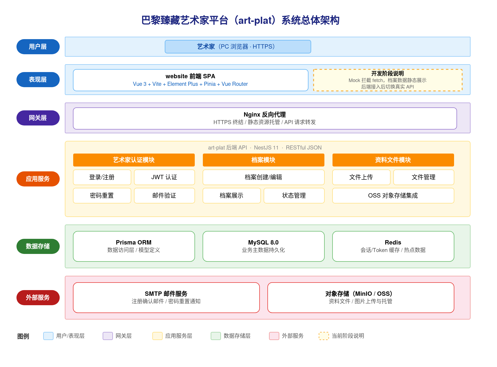
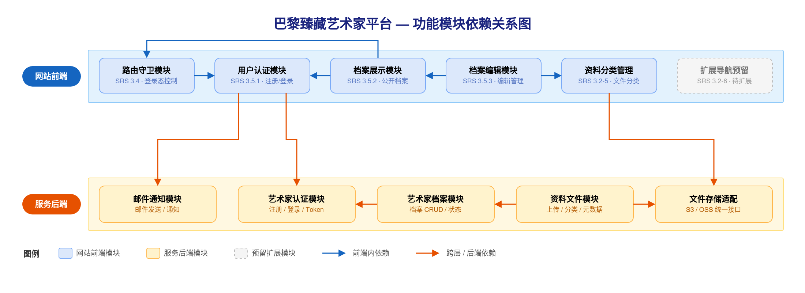
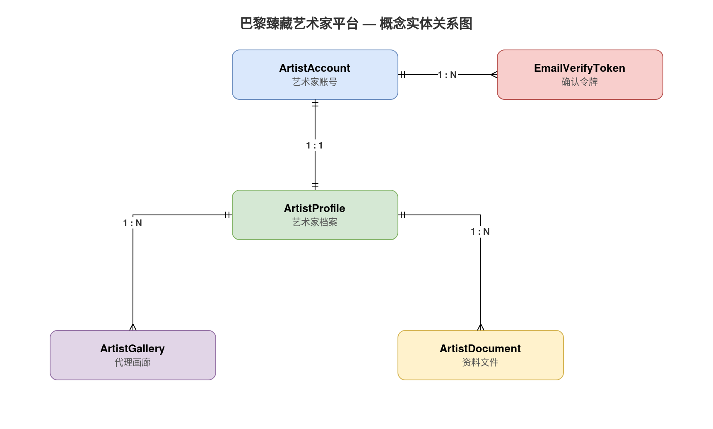
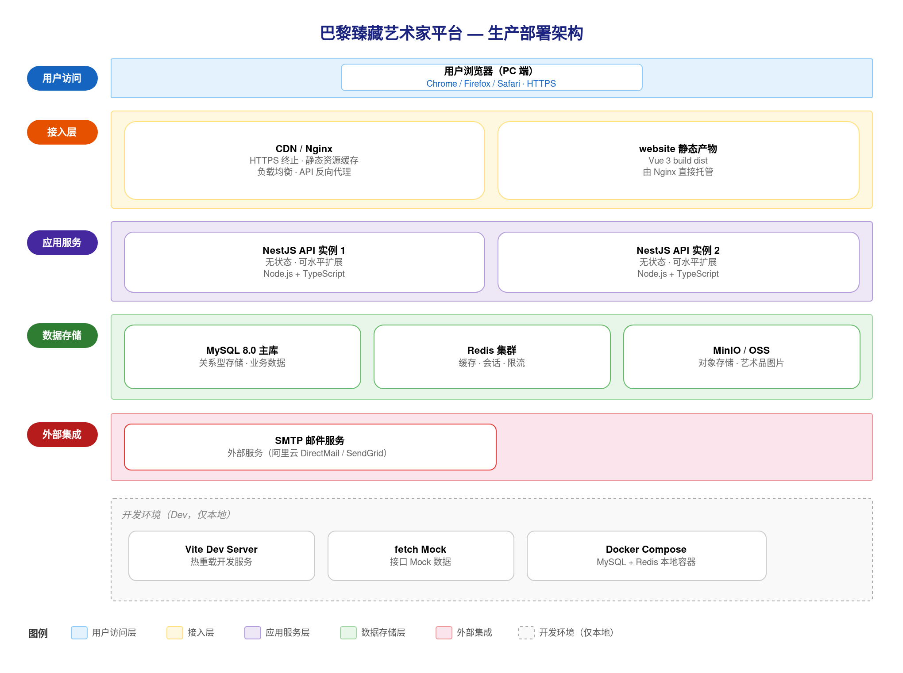

## 一、文档信息

| 项目名称 | 巴黎臻藏艺术家平台（art-plat） |
|---------|-------------------------------|
| 文档版本 | V1.1 |
| 编制日期 | 2025-06-21 |
| 编制人 | art-plat 项目组 |
| 关联需求文档 | docs/01-需求与规划/20250621-巴黎臻藏art-plat-SRS需求规格说明书-V1.0.md |
| 文档状态 | 草稿 |

**历史版本**

| 版本 | 日期 | 作者 | 更改说明 |
|-----|------|------|---------|
| V1.0 | 2025-06-21 | art-plat 项目组 | 初始版本，依据 SRS V1.0 生成 |
| V1.1 | 2025-06-21 | art-plat 项目组 | 审查修复：确认令牌存储策略、中国引言存储方案、开放项归档 |

---

## 二、引言

### 2.1 编写目的

本文档为巴黎臻藏艺术家平台（art-plat）的概要设计说明书（HLD），在 SRS 需求规格说明书 V1.0 基础上，从架构视角描述系统的总体结构、应用分层、功能模块划分、数据实体、接口分组、技术选型、部署形态及非功能性应对策略，作为详细设计（LLD）与后端对接阶段的架构依据。

预期读者：系统架构师、技术负责人、开发组长及参与本项目的后端/前端开发人员。

### 2.2 设计依据

| 依据类型 | 文档/来源 |
|---------|----------|
| 需求规格 | docs/01-需求与规划/20250621-巴黎臻藏art-plat-SRS需求规格说明书-V1.0.md |
| 前端实现基线 | website 项目（Vue 3 + TypeScript + Vite） |
| 后端框架基线 | server 项目（NestJS 11 + Prisma 6 + MySQL） |
| 安全约束 | SRS 4.3 安全方案、5.2 安全需求 |

> **SRS 待补充项说明**：SRS 中 2.4 业务流程图、3.1 总体功能架构图、3.5.x 用户操作流程图/时序图标注为「待补充」，不影响 HLD 架构设计；上述图表可在 diagram-generator 补充后同步更新 SRS 至 V1.1，HLD 架构结论不变。

### 2.3 术语与缩略语

| 术语 | 说明 |
|-----|------|
| HLD | 概要设计（High-Level Design），架构级设计文档 |
| LLD | 详细设计（Low-Level Design），字段级表结构与单接口明细 |
| SPA | 单页应用（Single Page Application） |
| JWT | JSON Web Token，用于登录态鉴权 |
| RBAC | 基于角色的访问控制（本系统艺术家端为单角色，admin 端沿用框架 RBAC） |
| 艺术家档案 | 包含个人信息、联系方式、代理画廊、中国引言与资料文件的完整展示单元 |
| 占位功能 | 界面已展示入口但尚未实现业务逻辑的功能（SRS 2.3 明确排除项） |

---

## 三、系统总体设计

### 3.1 系统定位

巴黎臻藏艺术家平台（art-plat）是一套面向**签约及受邀艺术家**的 PC 端 Web 档案平台，通过邮箱注册与确认机制建立可信账号体系，为已认证艺术家提供**中法双语档案只读展示与自助编辑**能力，并通过侧边栏导航框架为对话、展览等后续模块预留扩展入口。

核心业务能力一览：

| 业务能力 | 说明 |
|---------|------|
| 用户认证 | 邮箱注册 → 邮件确认 → 密码登录，未确认账号禁止登录 |
| 登录态访问控制 | 所有档案相关页面受保护，未登录访问跳转至登录页 |
| 档案只读展示 | 集中展示艺术家头部信息、个人信息、联系方式、代理画廊、中国引言与资料清单 |
| 档案自助编辑 | 支持维护个人信息、联系方式、代理画廊及五类资料上传（肖像、工作室、简历、作品集、媒体报道） |
| 双语一致体验 | 全站字段标签采用法文在前、中文在后的双语呈现 |
| 可扩展导航框架 | 侧边栏当前仅「我的档案」可用，其余 6 个模块作占位入口预留 |

### 3.2 系统边界

#### 3.2.1 系统职责

| 职责分类 | 具体内容 |
|---------|---------|
| 用户认证 | 邮箱注册、邮件确认（对接 SMTP 服务）、密码登录、JWT 登录态签发与校验 |
| 访问控制 | 基于登录态的路由守卫，保护档案展示页与编辑页 |
| 档案只读展示 | 艺术家档案首页展示（个人信息、联系方式、代理画廊、中国引言、资料清单） |
| 档案编辑 | 档案编辑页字段维护、五类资料文件上传（格式与大小校验） |
| 双语呈现 | 全站中法双语标签与内容渲染 |
| 导航框架 | 侧边栏当前可用模块路由，预留模块占位展示 |

#### 3.2.2 不在系统范围内

| 超出范围项 | 说明 |
|----------|------|
| 忘记密码 / 重发确认邮件 | 当前版本不支持，后续迭代规划 |
| 社交账号登录 | 不在 V1.0 范围内 |
| 6 个预留导航模块的实际功能 | 对话、展览、臻藏推荐、搜索、关于我们、联系我们均为占位入口 |
| 档案展示页资料的查看 / 编辑 / 上传 | 当前为 UI 占位，无实际业务逻辑 |
| 编辑页「更换头像」的实际上传逻辑 | 当前为占位按钮 |
| 档案保存落库 | V1.0 保存为模拟延迟后返回展示页，数据修改不写入持久层 |
| 管理后台运营功能 | 不在艺术家端 V1.0 交付范围 |

#### 3.2.3 外部系统交互

| 外部系统 | 交互方式 | 用途 | 状态 |
|---------|---------|------|------|
| SMTP 邮件服务 | SMTP 协议，由 NestJS 后端调用 | 发送注册确认邮件 | 待对接 |
| 对象存储 | HTTP API，由 NestJS 后端调用 | 存储五类资料文件与画廊标识 | 选型待定 |

### 3.3 系统总体架构图

**关键节点解读：**

1. **客户端层（Browser SPA）**：艺术家通过 PC 浏览器访问 `website` 单页应用。前端基于 Vue 3 + TypeScript + Vite 构建，Vue Router 路由守卫负责登录态拦截，未登录的档案访问请求将被重定向至登录页。

2. **Nginx 反向代理**（生产环境）：承担静态资源托管与 API 请求转发职责。所有 `/api/*` 请求经 Nginx 路由至 NestJS 后端服务，前端静态产物由 Nginx 直接服务。

3. **NestJS API 服务**：负责用户认证（JWT 签发/校验）、登录态鉴权守卫、档案数据读写及文件上传转存。当前 V1.0 阶段档案数据写入为 mock，认证接口待与真实后端对接。

4. **SMTP 邮件服务**（外部）：注册确认流程由 NestJS 触发，调用外部 SMTP 服务发送确认邮件。

5. **对象存储**（外部，待选型）：五类资料文件上传后由 NestJS 后端转存，前端通过存储 URL 渲染资料清单。

6. **开发阶段说明**：当前 `website` 前端使用 **fetch Mock** 提供认证接口模拟响应，档案数据为**静态内容**。正式对接时替换 Mock 为真实 API 调用即可。

**系统边界总结：** art-plat 是典型的**前后端分离** Web 应用，前端 SPA 与 NestJS API 通过 REST 协议通信，V1.0 以「认证 + 档案展示 + 档案编辑」为核心交付范围。

---

## 四、应用架构

### 4.1 分层设计

本系统采用前后端分离的分层架构，按实际技术栈裁剪为五层，自上而下职责单一、依赖单向向下。

| 分层 | 职责 | 关键技术 |
|------|------|---------|
| 表现层 | 用户交互与页面渲染；SPA 单页应用，客户端路由，状态管理 | Vue 3 + TypeScript + Vite + Element Plus + Tailwind CSS + Pinia + Vue Router |
| 网关层 | HTTPS 终止、静态资源托管、API 反向代理 | Nginx |
| 应用服务层 | 业务逻辑编排、认证鉴权、文件处理；按业务域拆分 NestJS 模块 | NestJS 11 + TypeScript |
| 数据访问层 | 统一数据库操作抽象，类型安全查询 | Prisma ORM |
| 数据层 | 持久化业务主数据；缓存 Token 与热点数据 | MySQL 8.0 + Redis |

**分层说明：**

- 表现层与应用服务层通过 Nginx 解耦，前端静态资源由 Nginx 托管，API 请求统一转发至 NestJS。
- 应用服务层全部经由 Prisma ORM 访问 MySQL，不直接编写 SQL。
- Redis 承载 Token 黑名单、邮件确认令牌缓存等短生命周期数据，不作为主数据来源。

### 4.2 功能模块划分

#### 4.2.1 前端模块（website SPA）

| 模块 | 职责 | 对应 SRS 功能 | 依赖模块 |
|------|------|-------------|---------|
| 路由守卫 | 全局导航拦截；检查登录态，未认证请求重定向至登录页 | 3.4 | 用户认证 |
| 用户认证 | 注册、邮件确认、登录/退出；管理 Pinia 认证状态与 Token | 3.5.1 | 后端认证 API |
| 档案展示 | 只读档案首页；侧边导航；资料清单摘要展示 | 3.5.2 | 路由守卫 |
| 档案编辑 | 字段编辑、资料上传/删除、保存/取消流程 | 3.5.3 | 档案展示、资料分类管理 |
| 资料分类管理 | 五类资料（肖像/工作室/简历/作品集/媒体报道）独立上传与删除 | 3.2-5 | 文件存储适配（后端） |
| 扩展导航预留 | 侧边栏 6 个占位菜单项，当前不可点击 | 3.2-6 | 无 |

**前端模块划分依据：** 按业务流程阶段划分——认证、档案读取、档案写入、资料管理各自独立；路由守卫作为横切关注点独立成模块；扩展导航预留独立占位，后续迭代无需修改导航结构。

#### 4.2.2 后端模块（server — artist 域，待新增）

| 模块 | 职责 | 对应 SRS 功能 | 依赖模块 |
|------|------|-------------|---------|
| 艺术家认证模块 | 注册、邮件确认、登录（JWT 签发）、退出 | 3.5.1 | 邮件通知模块 |
| 艺术家档案模块 | 档案信息查询与更新 | 3.5.2、3.5.3 | 艺术家认证模块 |
| 资料文件模块 | 五类资料上传接收、删除、分类查询 | 3.2-5 | 文件存储适配、艺术家档案模块 |
| 邮件通知模块 | 注册确认邮件模板渲染与发送 | 3.5.1 | 外部 SMTP |
| 文件存储适配模块 | 统一文件存取接口，屏蔽底层存储实现 | 3.2-5 | 无 |

**后端模块划分依据：** artist 域与框架 SysUser / admin RBAC 完全解耦，艺术家账号独立管理，避免角色混入后台权限体系。

### 4.3 模块依赖关系

**前端依赖方向：**

- 路由守卫依赖用户认证模块获取登录状态，档案相关页面均经路由守卫。
- 档案编辑依赖档案展示（页面跳转关系）并依赖资料分类管理完成文件操作。
- 资料分类管理通过 HTTP 调用后端资料文件模块，不直接访问存储层。

**后端依赖方向（无循环）：**

- 艺术家认证模块是 artist 域入口，其他业务模块通过 JWT Guard 校验身份。
- 资料文件模块依赖文件存储适配模块；存储适配模块不依赖业务模块，可独立替换实现。
- 邮件通知模块仅被认证模块调用，为单向依赖的叶子模块。

---

## 五、数据架构

### 5.1 核心业务实体

| 实体 | 业务含义 | 关联实体 | 关系类型 |
|-----|---------|---------|---------|
| 艺术家账号（ArtistAccount） | 平台登录账号，含邮箱、密码哈希、确认状态 | 艺术家档案 | 1:1 档案 |
| 艺术家档案（ArtistProfile） | 艺术家完整档案，含个人信息、联系方式、中国引言（法文 4 段 + 中文 4 段，JSON 数组存储）、头像 | 代理画廊、资料文件 | 1:N 画廊；1:N 资料 |
| 代理画廊（ArtistGallery） | 艺术家所属代理画廊条目 | 艺术家档案 | N:1 档案 |
| 资料文件（ArtistDocument） | 五类资料文件的元信息（类别、文件名、存储路径） | 艺术家档案 | N:1 档案 |

**非持久化逻辑对象（非 MySQL 表）：**

| 逻辑对象 | 存储位置 | 说明 |
|---------|---------|------|
| 邮件确认令牌（EmailVerifyToken） | Redis（TTL 24h） | 注册确认链接中的令牌，短生命周期，过期自动失效；概念 ER 图中保留该对象表示业务关系，但不落 MySQL 表 |

> 注：上述 artist 域 MySQL 实体当前尚未写入 `server/prisma/schema.prisma`，属于后端对接阶段新增设计；框架已有的 SysUser 等系统实体供 admin 端使用，与艺术家端账号体系分离。

### 5.2 概念实体关系图

### 5.3 存储选型

| 存储类型 | 选型 | 承载数据 | 理由 |
|---------|------|---------|------|
| 关系数据库 | MySQL 8.0 | 艺术家账号、档案、画廊、资料元信息 | 项目 server 已采用 Prisma + MySQL，支持事务与结构化查询 |
| 缓存 | Redis | JWT 黑名单、邮件确认令牌（EmailVerifyToken，TTL 24h）、热点档案缓存 | server 框架已集成 cache-manager + ioredis |
| 对象存储 | MinIO / 云 OSS（待选型） | 资料文件、画廊标识图片 | 文件体积与数量增长后不适合存 MySQL BLOB；通过存储适配模块屏蔽差异 |
| 浏览器本地 | localStorage / sessionStorage | 前端 JWT Token、Pinia 持久化 | 当前 website 登录态在浏览器会话内保持 |

---

## 六、接口架构

### 6.1 接口分组

| 接口分组 | 所属模块 | 对外/对内 | 协议 | 说明 |
|---------|---------|----------|------|------|
| 艺术家认证接口 | 艺术家认证模块 | 对外（website） | REST/JSON | 注册、登录、邮箱确认、退出、当前用户 |
| 艺术家档案接口 | 艺术家档案模块 | 对外（website） | REST/JSON | 档案查询、档案更新（待对接） |
| 资料文件接口 | 资料文件模块 | 对外（website） | REST/JSON + multipart | 资料上传、删除、分类列表（待对接） |
| 邮件回调接口 | 邮件通知模块 | 对内 | SMTP | 注册确认邮件发送，不暴露给前端 |
| 文件存储接口 | 文件存储适配模块 | 对内 | HTTP/SDK | 对象存储读写，由资料文件模块调用 |
| 系统管理接口 | base 模块（框架已有） | 对内（admin） | REST/JSON | 用户/角色/菜单等，供 admin 端使用 |
| 运维健康检查接口 | NestJS 应用 | 对内（运维） | REST/JSON | `GET /health`，供 Nginx/容器编排探活，不对外暴露业务数据 |

### 6.2 接口协议

| 协议 | 适用场景 | 说明 |
|-----|---------|------|
| REST/JSON | 认证、档案读写、资料元信息 | 统一响应格式 `{ code, data, message }`；认证接口携带 `Authorization: Bearer <token>` |
| multipart/form-data | 资料文件上传、画廊标识上传 | 单文件 ≤10MB，格式 PNG/JPG/JPEG/PDF |
| SMTP | 注册确认邮件 | NestJS 后端调用外部邮件服务，前端不直接交互 |

### 6.3 第三方集成

| 外部系统 | 集成方式 | 用途 | 状态 |
|---------|---------|------|------|
| SMTP 邮件服务 | NestJS + nodemailer/SMTP | 注册确认邮件 | 待选型对接 |
| 对象存储 | NestJS HTTP/SDK 适配 | 资料文件持久化 | 待选型（MinIO/OSS） |

---

## 七、技术架构

| 层 | 技术选型 | 版本/来源 | 选型理由 |
|----|---------|----------|---------|
| 前端框架 | Vue 3 + TypeScript | website/package.json | 项目已实现，Composition API 适合表单密集型档案页 |
| 构建工具 | Vite | ^8.0 | 快速 HMR，与 Vue 3 生态匹配 |
| UI 组件库 | Element Plus | ^2.14 | 表单、上传、布局组件齐全 |
| CSS 框架 | Tailwind CSS | ^4.3 | 原子化样式，配合品牌定制 |
| 状态管理 | Pinia | ^3.0 | 轻量，管理认证状态 |
| 路由 | Vue Router | ^4.6 | SPA 路由守卫实现登录态控制 |
| 后端框架 | NestJS | ^11.0 | server 已有模块化架构，支持 Guard/Interceptor |
| ORM | Prisma | ^6.0 | 类型安全，迁移管理，与 NestJS 集成成熟 |
| 数据库 | MySQL | 8.0 | Docker 开发环境已配置 |
| 缓存 | Redis + ioredis | ^5.4 | 框架已集成 cache-manager-ioredis-yet |
| 鉴权 | JWT + Passport | @nestjs/jwt ^11 | 无状态 Token，适合前后端分离 |
| 密码加密 | bcrypt | ^6.0 | 行业标准哈希算法 |
| API 文档 | Swagger | @nestjs/swagger ^11 | 自动生成接口文档 |
| 文件上传 | multer | ^2.0 | NestJS 生态标准中间件 |
| 反向代理 | Nginx | - | 生产环境 HTTPS 与静态资源托管 |
| 容器化 | Docker Compose | server/docker | 开发/生产环境 MySQL + Redis 一键启动 |

**鉴权方案：** 艺术家登录成功后签发 JWT，前端存储 Token 并在请求头携带；NestJS JwtAuthGuard 校验 Token 有效性与账号确认状态。

**文件上传规则决策：** 以编辑页规则为准（PNG/JPG/JPEG/PDF，单文件 ≤10MB）；展示页底部说明（MP4/200MB）为占位文案，待展示页上传功能实现时与编辑页统一。

**文件存储方案：** 通过文件存储适配模块抽象，开发环境可用本地磁盘，生产环境切换对象存储，前端仅感知 URL。

---

## 附录 A：架构开放项（待 LLD 前确认）

| 编号 | 决策项 | 候选方案 | 影响范围 |
|-----|-------|---------|---------|
| O-1 | Token 持久化方式 | localStorage + Bearer Header（当前）/ httpOnly Cookie | 前端存储、XSS 防护、跨域配置 |
| O-2 | SMTP 邮件服务选型 | 自建 SMTP / SendGrid / 阿里云邮件推送 | 注册确认流程、部署配置 |
| O-3 | 对象存储选型 | MinIO（自建）/ 阿里云 OSS / AWS S3 | 资料文件模块、部署成本 |
| O-4 | 艺术家账号与 SysUser 关系 | 完全独立 ArtistAccount 表（推荐）/ 扩展 SysUser | 数据模型、鉴权 Guard |
| O-5 | 档案 API 对接时序 | 先后端 Mock 切换 / 一次性切换 | 前端联调计划 |
| O-6 | 中国引言存储细化 | JSON 数组（4 段法文 + 4 段中文，HLD 已定）/ 独立子表 | LLD 表结构设计 |

---

## 八、部署架构

### 8.1 部署形态

| 维度 | 方案 |
|-----|------|
| 架构模式 | 前后端分离单体部署（V1.0 不拆微服务） |
| 终端 | PC 端 Web 浏览器（Chrome/Firefox/Safari/Edge 最新版） |
| 环境划分 | 开发（Vite dev + NestJS watch + Docker MySQL/Redis）、测试、生产 |
| 当前阶段 | website 独立运行，认证 Mock、档案静态；server 可并行开发 artist 域 |

### 8.2 部署架构图

### 8.3 高可用与扩展策略

| 策略 | 说明 |
|-----|------|
| 无状态 API | NestJS 服务无本地会话，可水平扩展多实例 |
| 负载均衡 | 生产环境 Nginx upstream 多实例 NestJS |
| 数据库 | MySQL 主从复制（生产可选）；开发环境单实例 |
| 静态资源 | website 构建产物由 Nginx/CDN 托管 |
| 文件存储 | 对象存储自带高可用，不依赖应用服务器本地磁盘 |
| 健康检查 | NestJS 提供 `/health` 端点供 Nginx/容器编排探活 |

---

## 九、非功能性设计

| SRS 非功能需求 | 指标/要求 | 架构应对策略 |
|-------------|----------|------------|
| 页面加载性能（5.1） | 页面加载 < 3 秒 | Vite 构建产物压缩；Nginx gzip；静态资源 CDN；档案 API 分页与 Redis 热点缓存 |
| 操作反馈（5.1） | 登录/注册/保存须加载状态 | 前端统一 loading 状态（Pinia/组件级）；API 超时 10s 中断（已实现） |
| 传输安全（5.2） | 生产 HTTPS | Nginx SSL 终止；HSTS 响应头 |
| 密码安全（5.2） | 最小 8 位，输入不可见 | 前端密码框 type=password；后端 bcrypt 哈希存储 |
| 访问控制（5.2） | 基于登录态 | Vue Router beforeEach 守卫 + NestJS JwtAuthGuard 双重校验 |
| 登录失败提示（5.2/SRS 3.5.1） | 统一错误文案，防账号枚举 | 后端统一返回「邮箱或密码错误」 |
| 邮箱确认（5.2/SRS 3.5.1） | 未确认禁止登录 | 认证模块校验确认状态；前端拦截并提示 |
| 双语一致性（5.3） | 法文在前、中文在后 | 前端 i18n 标签常量或组件级双语模板，全站统一顺序 |
| 表单校验提示（5.3） | 明确中文提示 | Element Plus 表单校验 + 自定义 rules，字段旁/顶部展示 |
| 浏览器兼容（5.4） | Chrome/Firefox/Safari/Edge 最新版 | Vue 3 + Vite 默认 ES2015+ 构建目标；避免非标准 API |
| 响应式（5.4） | PC 为主，窄屏侧边栏隐藏 | Tailwind 响应式断点；侧边栏 `@media` 隐藏，主内容区可访问 |

---

## 十、公共机制设计

### 10.1 统一鉴权

- **前端**：Pinia `authStore` 管理 Token 与用户信息；路由 meta 标记 `requiresAuth` / `guestOnly`；401 响应触发全局登出。
- **后端**：Passport JWT Strategy 解析 Token；artist 域 Guard 校验账号确认状态与 Token 黑名单（Redis）。

### 10.2 统一异常处理

- **后端**：NestJS 全局 Exception Filter，统一 `{ code, data, message }` 响应格式；业务异常与 HTTP 状态码映射。
- **前端**：API 层统一解析响应 code，非 0 时展示 message 提示。

### 10.3 文件上传校验

- 前端：上传前校验格式（PNG/JPG/JPEG/PDF）与大小（≤10MB），不符阻止并提示。
- 后端：multer 接收 + 服务端二次校验，防止绕过前端限制。

### 10.4 日志与审计

- 框架已有 base 模块操作日志（SysLog），artist 域关键操作（注册、登录、档案变更）可复用日志机制记录。

### 10.5 双语呈现规范

- 字段标签格式：`法文 / 中文`，法文在前。
- 按钮文案：`法文 / 中文` 并排，与 SRS 3.5.2、3.5.3 约定一致。

---

**文档说明**：本文档依据 SRS V1.0 生成，架构图源文件位于 `docs/images/src/hld-*.xml`，PNG 已渲染至 `docs/02-架构与设计/images/`（4 张，均已验证可达）。artist 域后端模块与 MySQL 实体为对接阶段新增设计，当前 website 以 Mock/静态数据运行。
