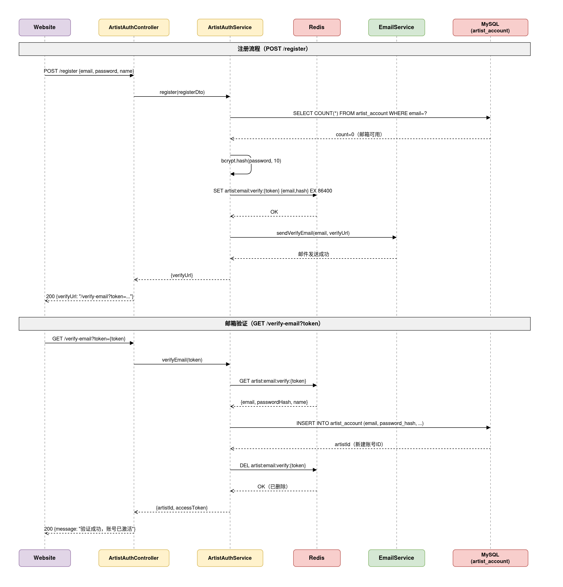
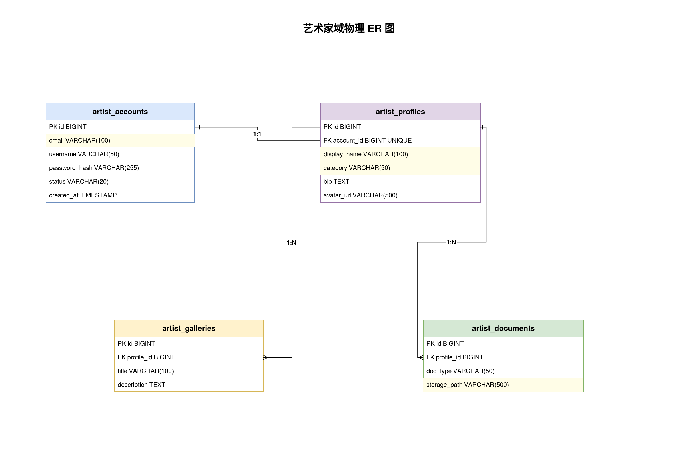

## 一、文档信息

| 项目名称 | 巴黎臻藏艺术家平台（art-plat） |
|---------|-------------------------------|
| 文档版本 | V1.1 |
| 编制日期 | 2025-06-21 |
| 编制人 | art-plat 项目组 |
| 关联需求文档 | docs/01-需求与规划/20250621-巴黎臻藏art-plat-SRS需求规格说明书-V1.0.md |
| 关联概要设计 | docs/02-架构与设计/20250621-巴黎臻藏art-plat-概要设计说明书-V1.1.md |
| 文档状态 | 草稿 |

**历史版本**

| 版本 | 日期 | 作者 | 更改说明 |
|-----|------|------|---------|
| V1.0 | 2025-06-21 | art-plat 项目组 | 初始版本，覆盖 artist 域后端 5 个模块 |
| V1.1 | 2025-06-21 | art-plat 项目组 | 审查修复：RESTful 路径、幂等策略、归属校验、追溯矩阵补全 |

---

## 二、引言

### 2.1 编写目的

本文档为巴黎臻藏艺术家平台（art-plat）的详细设计说明书（LLD），在 HLD V1.1 基础上，将 artist 域后端模块细化到类/服务、数据库物理结构、API 签名与错误码级别，供 backend-generator 直接编码实现。

预期读者：后端开发工程师、测试工程师、技术负责人。

### 2.2 设计依据

| 依据类型 | 文档/来源 |
|---------|----------|
| 需求规格 | docs/01-需求与规划/20250621-巴黎臻藏art-plat-SRS需求规格说明书-V1.0.md |
| 概要设计 | docs/02-架构与设计/20250621-巴黎臻藏art-plat-概要设计说明书-V1.1.md |
| 交付计划 | docs/delivery-plan.md（Phase 2 后端开发） |
| 前端基线 | website/src/api/auth.ts、website/src/views/profile/*.vue |
| 后端基线 | server/src/modules/artist/（login/me/logout 已实现） |
| 数据库规范 | database.md（必备字段以项目 Prisma 惯例映射） |
| 后端规范 | backend.md |
| 安全规范 | security.md |

### 2.3 全局约定

**统一响应格式（website C 端）：**

与现有认证接口及前端 Mock 对齐，成功 `code=0`（区别于 admin 端 `code=200`）：

```typescript
interface AppApiResponse<T> {
  code: number      // 0=成功；4xx/5xx 业务码与 HTTP 状态一致
  data: T | null
  message: string
}
```

**时间字段映射：**

| database.md 规范 | 本项目 Prisma 字段 | MySQL 列名 |
|-----------------|-------------------|-----------|
| id | id | id |
| created_at | createTime | createTime |
| updated_at | updateTime | updateTime |
| created_by | — | 艺术家域 C 端表暂不引入（账号即操作人） |
| updated_by | — | 同上 |

**命名规范：**

- 表名：snake_case 复数（Prisma `@@map`），如 `artist_accounts`
- 字段：Prisma camelCase，MySQL 列与字段名一致
- 路由前缀：C 端 `/api/*`，鉴权 Guard 为 `ArtistAuthGuard`

**错误码分段：**

| 区间 | 含义 |
|------|------|
| 0 | 成功 |
| 400–429 | 客户端/业务错误（与 HTTP 状态一致） |
| 401 | 未登录或 Token 无效 |
| 403 | 越权 |
| 404 | 资源不存在 |
| 409 | 冲突（邮箱已注册等） |
| 410 | 资源已过期 |
| 500 | 服务器内部错误 |

**鉴权约定：**

- JWT Payload：`{ userId, email, role }`
- Redis 会话键：`artist:token:{userId}`，值与 JWT 一致
- 公开接口标注 `@Public()` + 按需 `@UseGuards(ArtistAuthGuard)`

**架构开放项决策（LLD 固化）：**

| 编号 | 决策 | 本 LLD 方案 |
|-----|------|-----------|
| O-2 SMTP | 开发环境不发真实邮件 | `NODE_ENV !== production` 时 register 返回 verifyUrl，EmailService 仅 Logger 输出 |
| O-3 对象存储 | 开发本地磁盘 | `LocalStorageAdapter` 写入 `uploads/`；生产切换 `OssStorageAdapter`（待实现） |
| O-6 中国引言 | JSON 数组 | `quoteParagraphs` JSON 字段，4 段 `{ fr, zh }` |

---

## 三、模块详细设计

### 3.1 艺术家认证模块

**模块职责：** 负责 website C 端邮箱注册、邮箱确认、密码登录、当前用户查询与退出；与 admin SysUser 完全隔离。（HLD 4.2.2，SRS 3.5.1）

**实现状态：** login / me / logout ✅；register / verify-email ⬜

**核心类/服务设计：**

| 类/服务名 | 文件路径 | 职责 | 关键方法 |
|----------|---------|------|---------|
| ArtistAuthController | `modules/artist/controllers/auth.controller.ts` | 路由、参数校验、统一响应 | login, register, verifyEmail, me, logout |
| ArtistAuthService | `modules/artist/services/artist-auth.service.ts` | 认证业务逻辑 | login, register, verifyEmail, getMe, logout, hashPassword |
| ArtistAuthGuard | `common/guards/artist-auth.guard.ts` | JWT + Redis + 账号状态校验 | canActivate |
| ArtistLoginDto | `modules/artist/dto/artist-login.dto.ts` | 登录入参 | email, password |
| ArtistRegisterDto | `modules/artist/dto/artist-register.dto.ts` [新增] | 注册入参 | email, password |
| ArtistLoginResultVo | `modules/artist/vo/artist-auth.vo.ts` | 登录响应 | token, user |
| ArtistRegisterResultVo | `modules/artist/vo/artist-auth.vo.ts` [新增] | 注册响应 | verifyUrl |

**核心业务流程 — 注册与邮箱确认：**



处理步骤：

1. **POST /api/auth/register**：校验邮箱格式、密码 ≥8 位且含字母数字；查 `artist_accounts` 是否已存在已激活账号（409）；查 Redis 是否有同邮箱 pending token（409）；bcrypt 哈希密码；生成 UUID token；写 Redis `artist:email:verify:{token}` = `{ email, passwordHash }` TTL 86400s；调用 EmailService 发确认邮件；返回 `{ verifyUrl }`。
2. **GET /api/auth/verify-email?token=**：token 为空返回 400；Redis 无记录时若 DB 已存在同邮箱已激活账号则返回 409（幂等）；否则返回 404；TTL 过期返回 410；创建 `artist_accounts` 记录（emailVerified=true）；删除 Redis token（DEL 失败仅记日志，不影响成功响应，token 自然 TTL 过期）；返回成功。
3. **POST /api/auth/login**（已实现）：限流 5 次/分钟/IP；恒定耗时 bcrypt；未确认邮箱拒绝；签发 JWT 写 Redis。
4. **POST /api/auth/logout**（已实现）：删除 Redis token。

**状态机 — 账号激活：**

| 当前状态 | 触发条件 | 流转至 | 系统动作 |
|---------|---------|-------|---------|
| 未注册 | POST register | 待确认（Redis） | 写 verify token，发邮件 |
| 待确认 | GET verify-email 成功 | 已激活 | 写 artist_accounts，删 Redis |
| 待确认 | token 过期 | — | 返回 410，需重新注册 |
| 已激活 | POST login 成功 | 已登录 | 签发 JWT |
| 已激活 | POST logout | 未登录 | 删 Redis token |

**异常处理：**

| 异常场景 | 处理策略 | 错误反馈 |
|---------|---------|---------|
| 邮箱格式无效 | 拒绝 | 400「请输入有效的邮箱地址」 |
| 密码不符合规则 | 拒绝 | 400「密码需至少 8 位，且包含字母和数字」 |
| 邮箱已注册 | 拒绝 | 409「该邮箱已注册，请直接登录」 |
| 邮箱待确认重复注册 | 拒绝 | 409「该邮箱已提交注册，请查收确认邮件」 |
| 登录邮箱/密码错误 | 恒定耗时 | 401「邮箱或密码错误」 |
| 未确认邮箱登录 | 拒绝 | 401「邮箱尚未确认，请先查收确认邮件」 |
| 登录限流 | 拒绝 | 429「请求过于频繁，请稍后再试」 |

---

### 3.2 邮件通知模块

**模块职责：** 渲染注册确认邮件并调用 SMTP 发送；仅被认证模块调用，不暴露 HTTP 接口。（HLD 4.2.2，SRS 3.5.1）

**核心类/服务设计：**

| 类/服务名 | 文件路径 | 职责 | 关键方法 |
|----------|---------|------|---------|
| EmailService | `modules/artist/services/email.service.ts` [新增] | SMTP 封装、模板渲染 | sendVerificationEmail(to, verifyUrl) |

**配置项（.env）：**

| 变量 | 说明 | 开发默认值 |
|------|------|-----------|
| SMTP_HOST | SMTP 服务器 | 空（跳过发信） |
| SMTP_PORT | 端口 | 587 |
| SMTP_USER | 用户名 | — |
| SMTP_PASS | 密码 | — |
| SMTP_FROM | 发件人 | noreply@zhen.art |
| WEBSITE_BASE_URL | 确认链接域名 | http://localhost:5173 |

**开发环境降级：** 当 `SMTP_HOST` 未配置或 `NODE_ENV !== production` 时，`sendVerificationEmail` 仅 `Logger.log(verifyUrl)`，不抛错。

**邮件模板内容：**

- 主题：「巴黎臻藏 — 请确认您的邮箱」
- 正文：含 `{verifyUrl}` 超链接，24 小时内有效

---

### 3.3 艺术家档案模块

**模块职责：** 艺术家档案查询与更新，含个人信息、联系方式、中国引言、代理画廊；1:1 关联账号。（HLD 4.2.2，SRS 3.5.2、3.5.3）

**核心类/服务设计：**

| 类/服务名 | 文件路径 | 职责 | 关键方法 |
|----------|---------|------|---------|
| ProfileController | `modules/artist/controllers/profile.controller.ts` [新增] | 档案读写 API | getProfile, updateProfile |
| ProfileService | `modules/artist/services/profile.service.ts` [新增] | 档案业务、事务 | findOrCreate, update |

**核心业务流程 — 档案保存：**

1. `ArtistAuthGuard` 校验 JWT，取 `userId`
2. 查 `artist_profiles WHERE accountId = userId`；不存在则自动创建空档案
3. **PUT** 接收完整档案 JSON（personal + contact + quoteParagraphs + galleries）
4. Prisma `$transaction`：upsert profile → deleteMany galleries → createMany galleries（按数组顺序写 sortOrder）
5. 返回更新后完整档案

**异常处理：**

| 异常场景 | 处理策略 | 错误反馈 |
|---------|---------|---------|
| 未登录 | 拒绝 | 401 |
| 画廊超过 20 条 | 拒绝 | 400「代理画廊数量不能超过 20 条」 |
| 事务失败 | 回滚 | 500「保存失败，请稍后重试」 |

---

### 3.4 资料文件模块

**模块职责：** 五类资料文件上传、删除、分类列表；依赖存储适配与档案模块。（HLD 4.2.2，SRS 3.5.3）

**核心类/服务设计：**

| 类/服务名 | 文件路径 | 职责 | 关键方法 |
|----------|---------|------|---------|
| DocumentController | `modules/artist/controllers/document.controller.ts` [新增] | multipart 接收 | upload, remove, list |
| DocumentService | `modules/artist/services/document.service.ts` [新增] | 格式校验、归属校验 | uploadDocument, deleteDocument, listDocuments |

**资料分类枚举：**

| category | 法文 | 中文 |
|----------|------|------|
| portrait | Photos portrait | 肖像照片 |
| studio | Photos atelier | 工作室照片 |
| cv | CV | 个人简历 |
| portfolio | Portfolio | 作品集 |
| media | Couverture média | 媒体报道 |

**上传规则：** PNG/JPG/JPEG/PDF，单文件 ≤10MB；前端 + multer + 服务层三重校验。

**归属校验：** 所有写操作前执行 `artist_profiles WHERE id = profileId AND accountId = userId`；不匹配返回 403「无权操作此档案」。

**异常处理：**

| 异常场景 | 处理策略 | 错误反馈 |
|---------|---------|---------|
| MIME/扩展名不合法 | 拒绝 | 400「文件格式不支持，仅允许 PNG/JPG/JPEG/PDF」 |
| 文件超 10MB | 拒绝 | 400「文件大小超过 10MB 限制」 |
| category 非法 | 拒绝 | 400「无效的资料分类」 |
| profileId 越权 | 拒绝 | 403「无权操作此档案」 |
| 记录不存在 | 拒绝 | 404「资料记录不存在」 |

---

### 3.5 文件存储适配模块

**模块职责：** 统一文件存取接口，屏蔽本地磁盘与对象存储差异。（HLD 4.2.2）

**核心接口设计：**

```typescript
interface StorageAdapter {
  upload(file: Express.Multer.File, subPath: string): Promise<UploadResult>
  delete(storagePath: string): Promise<void>
  getUrl(storagePath: string): string
}

interface UploadResult {
  storagePath: string  // 如 portrait/42/uuid.jpg
  url: string          // 如 /uploads/portrait/42/uuid.jpg
  originalName: string
  mimeType: string
  fileSize: number
}
```

| 实现类 | 环境 | 存储路径 |
|-------|------|---------|
| LocalStorageAdapter | 开发/默认 | `process.cwd()/uploads/{storagePath}` |
| OssStorageAdapter | 生产（待实现） | MinIO/OSS SDK |

**StorageModule** 通过 NestJS Provider Token `STORAGE_ADAPTER` 注入，便于环境切换。

---

## 四、数据库物理设计

### 4.1 物理实体关系图



### 4.2 数据表清单

| 序号 | 表名 | 业务含义 | 所属模块 | 状态 |
|-----|------|---------|---------|------|
| 1 | artist_accounts | 艺术家登录账号 | 认证 | ✅ 已存在 |
| 2 | artist_profiles | 艺术家档案 | 档案 | ⬜ 待建 |
| 3 | artist_galleries | 代理画廊 | 档案 | ⬜ 待建 |
| 4 | artist_documents | 资料文件元信息 | 资料文件 | ⬜ 待建 |

**非持久化对象：**

| 逻辑对象 | 存储 | 说明 |
|---------|------|------|
| EmailVerifyToken | Redis `artist:email:verify:{token}` | TTL 86400s，值 `{ email, passwordHash }` |
| ArtistSession | Redis `artist:token:{userId}` | JWT 会话，TTL = JWT_ACCESS_EXPIRE |

### 4.3 表结构详细设计

#### 4.3.1 artist_accounts（艺术家账号）— 已存在

> 对应 Prisma `ArtistAccount`，无需变更。

| 字段名 | 类型 | 允许空 | 键 | 默认值 | 说明 |
|-------|------|-------|----|-------|------|
| id | INT | 否 | PK | AUTO | 主键 |
| email | VARCHAR(200) | 否 | UNIQUE | — | 登录邮箱 |
| password | VARCHAR | 否 | — | — | bcrypt 哈希 |
| name | VARCHAR(100) | 是 | — | — | 显示名称 |
| avatar | VARCHAR(500) | 是 | — | — | 头像 URL |
| role | VARCHAR(50) | 否 | — | artist | 角色 |
| emailVerified | BOOLEAN | 否 | — | false | 邮箱已确认 |
| status | INT | 否 | — | 1 | 1=启用 0=禁用 |
| createTime | DATETIME | 否 | — | now() | 创建时间 |
| updateTime | DATETIME | 否 | — | — | 更新时间 |

**索引：** PRIMARY(id)，UNIQUE(email)

---

#### 4.3.2 artist_profiles（艺术家档案）

| 字段名 | 类型 | 允许空 | 键 | 默认值 | 说明 |
|-------|------|-------|----|-------|------|
| id | INT | 否 | PK | AUTO | 主键 |
| accountId | INT | 否 | UNIQUE, FK | — | 关联 artist_accounts.id |
| displayName | VARCHAR(200) | 是 | — | — | 艺术家姓名（头部） |
| title | VARCHAR(100) | 是 | — | Artiste | 职位 |
| nationality | VARCHAR(100) | 是 | — | — | 国籍 |
| city | VARCHAR(100) | 是 | — | — | 所在城市 |
| avatarUrl | VARCHAR(500) | 是 | — | — | 头像 URL |
| birthYear | VARCHAR(50) | 是 | — | — | 出生年月 |
| birthPlace | VARCHAR(200) | 是 | — | — | 出生地 |
| residence | VARCHAR(200) | 是 | — | — | 现居地 |
| studyAbroad | VARCHAR(500) | 是 | — | — | 留学经历 |
| education | VARCHAR(500) | 是 | — | — | 学历 |
| website | VARCHAR(500) | 是 | — | — | 网站 |
| instagram | VARCHAR(200) | 是 | — | — | Instagram |
| xiaohongshu | VARCHAR(200) | 是 | — | — | 小红书 |
| wechat | VARCHAR(100) | 是 | — | — | 微信 |
| contactEmail | VARCHAR(200) | 是 | — | — | 联系邮箱（非登录邮箱） |
| phone | VARCHAR(50) | 是 | — | — | 电话 |
| quoteParagraphs | JSON | 是 | — | — | 中国引言 [{fr,zh}] ×4 |
| createTime | DATETIME | 否 | — | now() | 创建时间 |
| updateTime | DATETIME | 否 | — | — | 更新时间 |

**索引：**

| 索引名 | 字段 | 类型 | 说明 |
|-------|------|------|------|
| PRIMARY | id | 主键 | — |
| uk_artist_profiles_account_id | accountId | 唯一 | 1:1 账号 |
| idx_artist_profiles_account_id | accountId | 普通 | 外键查询 |

**关系：** accountId → artist_accounts.id（1:1，CASCADE）

**Prisma 模型：**

```prisma
model ArtistProfile {
  id              Int      @id @default(autoincrement())
  accountId       Int      @unique
  displayName     String?  @db.VarChar(200)
  title           String?  @default("Artiste") @db.VarChar(100)
  nationality     String?  @db.VarChar(100)
  city            String?  @db.VarChar(100)
  avatarUrl       String?  @db.VarChar(500)
  birthYear       String?  @db.VarChar(50)
  birthPlace      String?  @db.VarChar(200)
  residence       String?  @db.VarChar(200)
  studyAbroad     String?  @db.VarChar(500)
  education       String?  @db.VarChar(500)
  website         String?  @db.VarChar(500)
  instagram       String?  @db.VarChar(200)
  xiaohongshu     String?  @db.VarChar(200)
  wechat          String?  @db.VarChar(100)
  contactEmail    String?  @db.VarChar(200)
  phone           String?  @db.VarChar(50)
  quoteParagraphs Json?
  createTime      DateTime @default(now())
  updateTime      DateTime @updatedAt

  account   ArtistAccount    @relation(fields: [accountId], references: [id], onDelete: Cascade)
  galleries ArtistGallery[]
  documents ArtistDocument[]

  @@index([accountId])
  @@map("artist_profiles")
}
```

---

#### 4.3.3 artist_galleries（代理画廊）

| 字段名 | 类型 | 允许空 | 键 | 默认值 | 说明 |
|-------|------|-------|----|-------|------|
| id | INT | 否 | PK | AUTO | 主键 |
| profileId | INT | 否 | FK | — | 关联 artist_profiles.id |
| name | VARCHAR(200) | 是 | — | — | 画廊名称 |
| location | VARCHAR(200) | 是 | — | — | 城市国家 |
| logoUrl | VARCHAR(500) | 是 | — | — | 标识图片 URL |
| sortOrder | INT | 否 | — | 0 | 展示排序 |
| createTime | DATETIME | 否 | — | now() | 创建时间 |
| updateTime | DATETIME | 否 | — | — | 更新时间 |

**索引：** PRIMARY(id)，idx_artist_galleries_profile_id(profileId)

**关系：** profileId → artist_profiles.id（N:1，CASCADE）

---

#### 4.3.4 artist_documents（资料文件）

| 字段名 | 类型 | 允许空 | 键 | 默认值 | 说明 |
|-------|------|-------|----|-------|------|
| id | INT | 否 | PK | AUTO | 主键 |
| profileId | INT | 否 | FK | — | 关联 artist_profiles.id |
| category | VARCHAR(20) | 否 | — | — | portrait/studio/cv/portfolio/media |
| fileName | VARCHAR(255) | 否 | — | — | 原始文件名 |
| fileSize | INT | 否 | — | 0 | 字节 |
| mimeType | VARCHAR(100) | 否 | — | — | MIME 类型 |
| storagePath | VARCHAR(500) | 否 | — | — | 存储相对路径 |
| sortOrder | INT | 否 | — | 0 | 同分类排序 |
| createTime | DATETIME | 否 | — | now() | 创建时间 |
| updateTime | DATETIME | 否 | — | — | 更新时间 |

**索引：**

| 索引名 | 字段 | 类型 | 说明 |
|-------|------|------|------|
| PRIMARY | id | 主键 | — |
| idx_artist_documents_profile_id | profileId | 普通 | 外键 |
| idx_artist_documents_profile_category | (profileId, category) | 复合 | 分类列表查询 |

---

### 4.4 数据字典（枚举）

| 枚举类型 | 值 | 说明 |
|---------|----|----|
| account.status | 1 | 启用 |
| ^ | 0 | 禁用 |
| document.category | portrait | 肖像照片 |
| ^ | studio | 工作室照片 |
| ^ | cv | 个人简历 |
| ^ | portfolio | 作品集 |
| ^ | media | 媒体报道 |

---

## 五、API 详细设计

### 5.1 通用规范

website C 端接口统一 `{ code, data, message }`，鉴权接口携带 `Authorization: Bearer <token>`。

### 5.2 接口清单

| 序号 | 方法 | 路径 | 用途 | 鉴权 | 所属模块 | 状态 |
|-----|------|------|------|------|---------|------|
| 1 | POST | /api/auth/login | 登录 | 公开 | 认证 | ✅ |
| 2 | GET | /api/auth/me | 当前用户 | JWT | 认证 | ✅ |
| 3 | POST | /api/auth/logout | 退出 | JWT | 认证 | ✅ |
| 4 | POST | /api/auth/register | 注册 | 公开 | 认证 | ⬜ |
| 5 | GET | /api/auth/verify-email | 邮箱确认 | 公开 | 认证 | ⬜ |
| 6 | GET | /api/profile | 查询档案 | JWT | 档案 | ⬜ |
| 7 | PUT | /api/profile | 更新档案 | JWT | 档案 | ⬜ |
| 8 | POST | /api/documents | 上传资料 | JWT | 资料文件 | ⬜ |
| 9 | DELETE | /api/documents/:id | 删除资料 | JWT | 资料文件 | ⬜ |
| 10 | GET | /api/documents | 资料列表 | JWT | 资料文件 | ⬜ |

### 5.3 接口详细设计

#### 5.3.1 注册 — POST /api/auth/register

- **用途：** 提交邮箱密码，发送确认邮件
- **鉴权：** 公开（@Public）

**请求 Body：**

| 参数 | 类型 | 必填 | 校验 |
|-----|------|------|------|
| email | string | 是 | 邮箱格式 |
| password | string | 是 | ≥8 位，含字母和数字 |

**成功响应：**

```json
{ "code": 0, "data": { "verifyUrl": "http://localhost:5173/verify-email?token=..." }, "message": "注册成功，请查收确认邮件" }
```

**错误码：**

| 场景 | HTTP | code | message |
|-----|------|------|---------|
| 邮箱格式无效 | 400 | 400 | 请输入有效的邮箱地址 |
| 密码不合规 | 400 | 400 | 密码需至少 8 位，且包含字母和数字 |
| 邮箱已注册 | 409 | 409 | 该邮箱已注册，请直接登录 |
| 待确认重复提交 | 409 | 409 | 该邮箱已提交注册，请查收确认邮件 |

---

#### 5.3.2 邮箱确认 — GET /api/auth/verify-email

- **用途：** 激活账号
- **鉴权：** 公开

**Query 参数：**

| 参数 | 类型 | 必填 | 说明 |
|-----|------|------|------|
| token | string | 是 | 确认令牌 |

**成功响应：**

```json
{ "code": 0, "data": null, "message": "邮箱确认成功，现在可以登录了" }
```

**错误码：**

| 场景 | HTTP | code | message |
|-----|------|------|---------|
| token 缺失 | 400 | 400 | 确认链接无效 |
| token 不存在 | 404 | 404 | 确认链接无效或已过期 |
| token 过期 | 410 | 410 | 确认链接已过期，请重新注册 |
| 邮箱已确认 | 409 | 409 | 该邮箱已完成确认，请直接登录 |

---

#### 5.3.3 查询档案 — GET /api/profile

- **用途：** 获取当前艺术家完整档案（含 galleries、documents 摘要）
- **鉴权：** JWT + ArtistAuthGuard

**成功响应 data 结构：**

```json
{
  "id": 1,
  "displayName": "Willy Le Nalbaut",
  "title": "Artiste",
  "nationality": "France",
  "city": "Rennes",
  "avatarUrl": "/uploads/...",
  "personal": { "birthYear": "1965", "birthPlace": "...", "residence": "...", "studyAbroad": "—", "education": "..." },
  "contact": { "website": "...", "instagram": "...", "xiaohongshu": "...", "wechat": "...", "email": "...", "phone": "..." },
  "quoteParagraphs": [{ "fr": "...", "zh": "..." }],
  "galleries": [{ "id": 1, "name": "...", "location": "...", "logoUrl": "...", "sortOrder": 0 }],
  "documentSummary": [{ "category": "portrait", "count": 5 }]
}
```

首次访问自动创建空档案。

---

#### 5.3.4 更新档案 — PUT /api/profile

- **用途：** 保存档案字段与代理画廊（全量替换 galleries）
- **鉴权：** JWT

**请求 Body：** 与 GET 响应 data 结构一致（不含 documentSummary）

**成功响应：** 返回更新后完整档案

**事务：** Prisma `$transaction` 原子写入 profile + galleries

**错误码：**

| 场景 | HTTP | code | message |
|-----|------|------|---------|
| 画廊超过 20 条 | 400 | 400 | 代理画廊数量不能超过 20 条 |
| 未登录 | 401 | 401 | 未登录或 token 无效 |
| 事务失败 | 500 | 500 | 保存失败，请稍后重试 |

---

#### 5.3.5 上传资料 — POST /api/documents

- **Content-Type：** multipart/form-data
- **鉴权：** JWT

| 参数 | 位置 | 类型 | 必填 | 说明 |
|-----|------|------|------|------|
| file | form-data | File | 是 | ≤10MB，PNG/JPG/JPEG/PDF |
| category | form-data | string | 是 | 五类枚举 |
| profileId | form-data | number | 是 | 须属于当前用户 |

**成功响应 data：**

```json
{ "id": 1, "category": "portrait", "fileName": "photo.jpg", "fileSize": 2048576, "mimeType": "image/jpeg", "url": "/uploads/portrait/1/uuid.jpg" }
```

**错误码：**

| 场景 | HTTP | code | message |
|-----|------|------|---------|
| 格式不支持 | 400 | 400 | 文件格式不支持，仅允许 PNG/JPG/JPEG/PDF |
| 超过 10MB | 400 | 400 | 文件大小超过 10MB 限制 |
| profileId 越权 | 403 | 403 | 无权操作此档案 |

---

#### 5.3.6 删除资料 — DELETE /api/documents/:id

- **鉴权：** JWT
- **成功：** `{ code: 0, data: null, message: "删除成功" }`
- **越权/不存在：** 403 / 404

---

#### 5.3.7 资料列表 — GET /api/documents

- **鉴权：** JWT

| 参数 | 位置 | 类型 | 必填 | 说明 |
|-----|------|------|------|------|
| profileId | query | number | 是 | 档案 ID |
| category | query | string | 否 | 不传返回全部 |

**排序：** category ASC, sortOrder ASC, createTime ASC

---

## 六、安全设计

| 安全维度 | 设计 |
|---------|------|
| 鉴权 | JWT + Redis 双校验；ArtistAuthGuard 校验 emailVerified 与 status |
| 密码 | bcrypt cost=12；登录失败恒定耗时防枚举 |
| 限流 | 登录 5 次/分钟/IP（Redis INCR） |
| 输入校验 | class-validator DTO 白名单；禁止非白名单字段 |
| 文件上传 | MIME + 扩展名双重校验；UUID 文件名；profileId 归属校验 |
| 路径安全 | path.join 拼接；禁止用户控制路径段 |
| 静态资源 | X-Content-Type-Options: nosniff（main.ts 已配置） |
| 敏感数据 | 密码哈希不返回；日志不输出 password/token |

---

## 七、可追溯矩阵

| 设计要素 | 类型 | 追溯来源 |
|---------|------|---------|
| artist_accounts | 表 | HLD 5.1 / SRS 3.5.1 |
| artist_profiles | 表 | HLD 5.1 / SRS 3.5.2、3.5.3 |
| artist_galleries | 表 | HLD 5.1 / SRS 3.5.2、3.5.3 |
| artist_documents | 表 | HLD 5.1 / SRS 3.5.3 |
| EmailVerifyToken (Redis) | 缓存 | HLD 5.1 / SRS 3.5.1 |
| POST /api/auth/register | 接口 | SRS 3.5.1 / delivery-plan B05 |
| GET /api/auth/verify-email | 接口 | SRS 3.5.1 / website mock |
| POST /api/auth/login | 接口 | SRS 3.5.1 / 已实现 |
| GET /api/auth/me | 接口 | SRS 3.5.1 / 已实现 |
| POST /api/auth/logout | 接口 | SRS 3.5.1 / 已实现 |
| GET /api/profile | 接口 | SRS 3.5.2 / delivery-plan B06 |
| PUT /api/profile | 接口 | SRS 3.5.3 / delivery-plan B06、B07 |
| POST /api/documents | 接口 | SRS 3.5.3 / delivery-plan B08 |
| DELETE /api/documents/:id | 接口 | SRS 3.5.3 / delivery-plan B08 |
| GET /api/documents | 接口 | SRS 3.5.3 / delivery-plan B08 |
| StorageAdapter | 类 | HLD 4.2.2 / delivery-plan B04 |
| EmailService | 类 | HLD 4.2.2 / delivery-plan B03 |
| quoteParagraphs JSON | 字段 | HLD O-6 / SRS 3.5.2 |
| category 五类枚举 | 字段 | website edit.vue / SRS 3.5.3 |

---

**文档说明：** 本 LLD 覆盖 delivery-plan Phase 2 全部 6 项待实现后端任务（B03–B08）。admin 框架模块不在本文档范围。图表源文件位于 `docs/images/src/lld-*.xml`。
